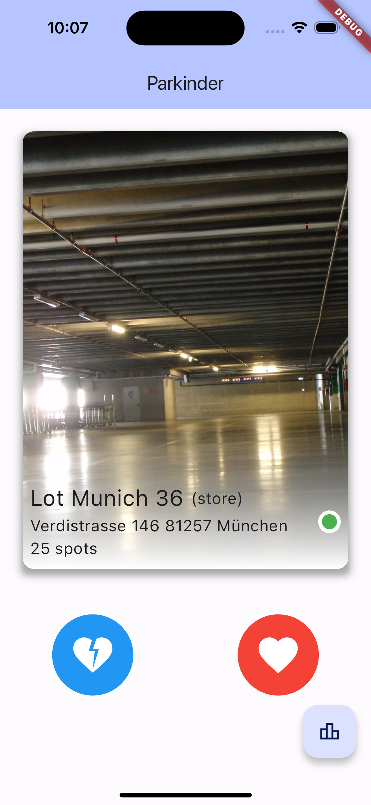
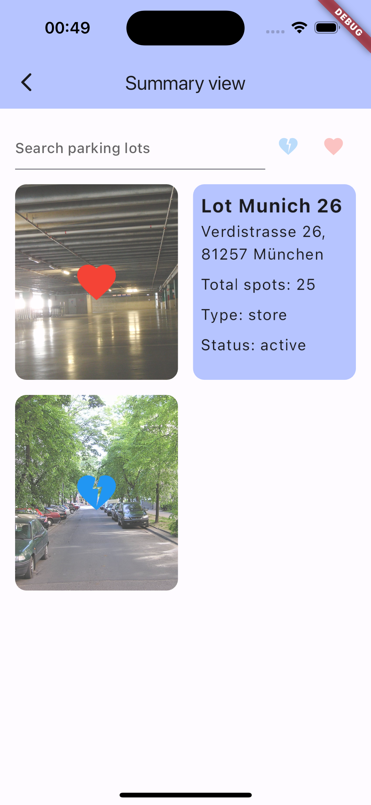

# ParkDepot Parking Lot Rating App

Welcome to the ParkDepot Parking Lot Rating App! This Flutter project allows users to rate the beauty of parking lots fetched from the ParkDepot GraphQL API in a Tinder-like interface. Users can swipe left to label a parking lot as avoidable and swipe right to label it as outstanding. Additionally, users can review their choices in a summary view.

## Features

- **Tinder View**: Users can swipe through parking lots one at a time, labeling them as "good" or "bad".
- **Pagination**: The app fetches parking lots in batches of 5 to ensure smooth performance.
- **Summary View**: Users can review their choices and see good and bad lots in a compact format.

## Installation

1. Clone the repository.
2. Navigate to the project directory.
3. Run `flutter pub get` to install dependencies.
4. Connect a device or emulator.
5. Run `flutter run` to launch the app.

## Screenshots

## Technologies Used

- Flutter
- GraphQL
- [swipe_cards](https://pub.dev/packages/swipe_cards) package for Tinder-like swiping interface.
